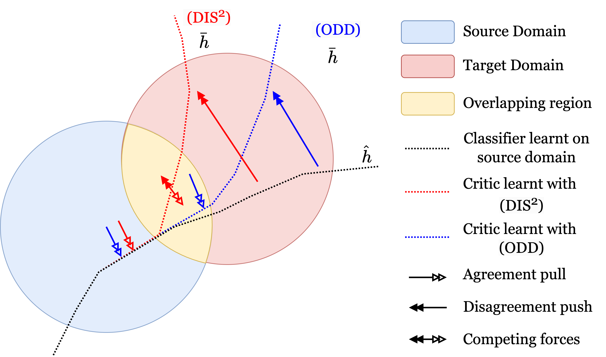

# ODD: Overlap-aware Estimation of Model Performance under Distribution Shift

<p align="center">

</p>

This repository contains code for evaluating the bounds and reproducing the experiments in the paper **ODD: Overlap-aware Estimation of Model Performance under Distribution Shift**, which builds upon the work of [**(Almost) Provable Error Bounds Under Distribution Shift via Disagreement Discrepancy**](https://arxiv.org/abs/2306.00312) by Elan Rosenfeld and Saurabh Garg.

**ODD** (**O**verlap-aware **D**isagreement **D**iscrepancy) is an enhanced method for providing guaranteed upper bounds on test error of classifiers using unlabeled test data under distribution shift. ODD improves upon the original Dis² method by incorporating overlap-aware weighting that accounts for the degree of overlap between source and target distributions.

## What's new in ODD?

ODD enhances the original Dis² method by:

1. **Overlap-aware weighting**: Uses a domain detector to identify overlapping vs. non-overlapping regions between source and target distributions
2. **Improved bounds**: Provides tighter bounds by focusing on non-overlapping regions where distribution shift is most problematic  
3. **Weighted disagreement discrepancy**: Computes disagreement discrepancy using overlap-aware weights for more accurate estimation
4. **Novel bound formulation**: Introduces a new bound that combines overlap-aware source validation accuracy with non-overlap target agreement

The key insight is that in overlapping regions between source and target distributions, the original model is likely to perform well. The interesting cases for bounding occur in non-overlapping regions where distribution shift has the most impact.

## Code Structure

```
odd/
├── src/
│   ├── eval/          # Evaluation scripts for ODD and baseline methods
│   │   ├── odd.py    # Main ODD evaluation script
│   │   └── other_methods.py  # Baseline method evaluations
│   ├── lib/           # Core library functions
│   │   ├── validation.py  # Validation and bound computation
│   │   ├── critic.py      # Critic network training
│   │   ├── utils.py       # Utility functions
│   │   └── consts.py      # Constants and dataset definitions
│   └── plot/          # Plotting and visualization scripts
├── synthetic.py       # Synthetic experiments
├── results/          # Output directory for results
└── README.md
```

## Usage

### 1. Running ODD on Real Datasets

To evaluate ODD bounds on real datasets with pretrained features:

```bash
python -m src.eval.odd --feats_dir FEATURE_DIRECTORY --results_dir RESULTS_DIRECTORY
```

**Key Arguments:**
- `--feats_dir`: Directory containing the pretrained features, labels, and logits
- `--results_dir`: Directory to save results 
- `--epochs`: Number of training epochs for critic (default: 50)
- `--critic_repeats`: Number of critic repetitions (default: 30)
- `--val_frac`: Fraction of data to use for validation (default: 0.5)
- `--detector_layers`: Number of layers in domain detector (default: 3)
- `--gpu_id`: GPU ID to use (default: '3')

**Example with custom parameters:**
```bash
python -m src.eval.odd \
    --feats_dir data/features/ \
    --results_dir results/odd_results/ \
    --epochs 100 \
    --critic_repeats 50 \
    --val_frac 0.3 \
    --detector_layers 4 \
    --gpu_id 0
```

### 2. Running Baseline Methods

To compare against baseline methods:

```bash
python -m src.eval.other_methods --feats_dir FEATURE_DIRECTORY --results_dir RESULTS_DIRECTORY
```

### 3. Synthetic Experiments

The synthetic experiments demonstrate ODD's performance across different overlap scenarios:

```bash
python synthetic.py --num_runs 20
```

**What the synthetic experiment does:**
- Generates 2D synthetic data with controllable overlap between source and target distributions
- Uses a curvy decision boundary to create realistic classification scenarios
- Trains domain detectors to identify overlapping vs. non-overlapping regions
- Compares ODD bounds against original Dis² bounds across different overlap factors
- Saves results to `results.pkl` for analysis

**Synthetic experiment parameters:**
- `--num_runs`: Number of experimental runs (default: 20)
- Each run tests 100 random overlap factors between 0.0 and 1.0
- Generates training/validation splits with 1500-2500 and 1000-1500 samples respectively

**Output:**
- Creates `results.pkl` containing bound comparisons
- Generates `bound_comparison.png` visualization (if plotting is enabled)

### 4. Visualization and Plotting

Generate comparison plots between methods:

Use the plot directory and see more instructions in the Dis² repository.